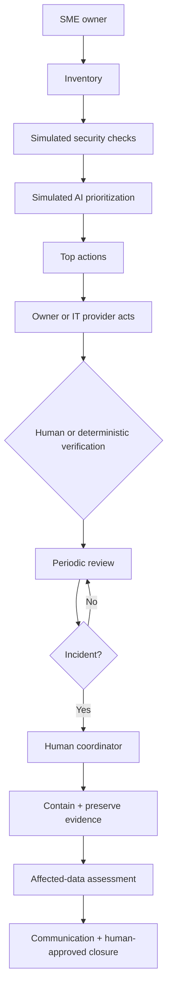

# ESCUDO PyME — PACKET.md

## Problem
Mexican SMEs can already access many cybersecurity controls, but a small business without an internal security team can still struggle to know what matters first, prove that a protection is actually in place, and respond in an organized way when something goes wrong. The opportunity is an operational layer, not another antivirus.

## Exact user
Owner/administrator of a small Mexican dental clinic with 2–3 locations, 15–30 employees, meaningful digital exposure, no internal cybersecurity team, and a third-party IT provider. The IT provider is the first operational partner; a named human coordinator owns escalation and irreversible decisions.

## Success definition
Before the module closes, a non-security SME owner can identify the first action, understand why it matters, distinguish recommendation from verified/completed, trigger a simulated incident, identify the next owner/severity/action, and find the human escalation path.

## Benchmark
Huntress-style managed security for SMEs plus a small verifiable baseline such as Cyber Essentials. ESCUDO PyME localizes the pattern into a Spanish-first, phone-first workflow for fragmented Mexican SME environments and connects prevention, verification and human response.

## Flow

## Stack
Static HTML/CSS/JS; simulated LLM explanation; simulated MFA/backup/access/device/provider checks; simulated breach dataset and workflow automation; browser-only state; static/Vercel deployment target.

## Scope cut
No antivirus, password manager, autonomous attacker contact, ransom payment, automatic notification decisions, safety certification, sensitive document collection, real personal data, or autonomous irreversible action.

## Test plan
Mechanical navigation test plus synthetic persona test. Persona: Doña Mari, 54, small dental clinic owner, WhatsApp user, reads slowly and distrusts complex apps. Pass condition: she can identify the first action, distinguish recommended from verified, and identify human escalation.

## Shadow
AI never pays a ransom, contacts an attacker, decides whether to notify affected people, certifies safety, or marks a control as verified. Irreversible actions require a named human. Exposure warnings include concrete next steps.

## Kill conditions
Kill/redesign if users interpret AI recommendations as guarantees, cannot find the human escalation path, the workflow adds confusion, sensitive storage becomes necessary, or no measurable continuity/response benefit exists.